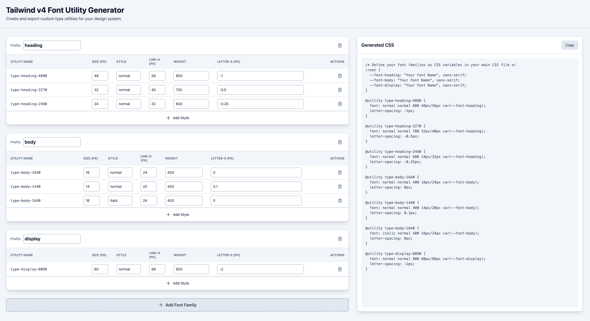

# Tailwind v4 font utility generator



A web application for creating custom font utility classes for Tailwind CSS v4. Design and export type utilities that match your design system with an intuitive interface.

## Features

- **Visual Font Configuration**: Add font families and configure styles (size, weight, line height, letter spacing)
- **Real-time CSS Generation**: Automatically generates Tailwind v4 `@utility` directives
- **State Persistence**: Save your configurations in the URL for sharing and bookmarking
- **Export Ready**: Copy generated CSS to integrate into your Tailwind project

## Getting Started

### Prerequisites

- Node.js (v16 or higher)
- npm or yarn

### Installation

1. Clone the repository:

```bash
git clone <repository-url>
cd tw-font-utility-generator
```

1. Install dependencies:

   ```bash
   npm install
   ```

### Running Locally

Start the development server:

```bash
npm run dev
```

Open [http://localhost:5173](http://localhost:5173) in your browser.

### Building for Production

```bash
npm run build
npm run preview
```

## Usage

1. **Add Font Families**: Click "Add Font Family" to create new font groups
1. **Configure Styles**: Adjust font size, weight, line height, and letter spacing for each style
1. **Copy CSS**: Use the generated CSS in your Tailwind v4 project's CSS file
1. **Define Font Variables**: Set `--font-*` CSS variables in your `:root` selector with actual font names

## Example Output

The app generates CSS like this:

```css
:root {
  --font-heading: "Inter", sans-serif;
  --font-body: "Open Sans", sans-serif;
}

@utility type-heading-32 {
  font: normal normal 700 32px/40px var(--font-heading);
  letter-spacing: 0px;
}

@utility type-body-16 {
  font: normal normal 400 16px/24px var(--font-body);
  letter-spacing: 0px;
}
```

## Contributing

Contributions are welcome! Please feel free to submit a Pull Request.
